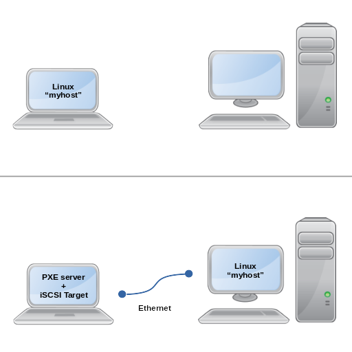

# openwrt-iscsi-target-ramdisk

## Overview

This project adds a preconfigured x86_64 OpenWrt ramdisk image to your boot menu that automatically serves your Linux kernels via PXE and storage via iSCSI, allowing you to PXE boot your regular OS over the network on another computer using Dracut `netroot=iscsi:...`.

For example, you can run your laptop OS on your more powerful desktop while still having access to all your laptop's files and programs.



You can also customize the OpenWrt ramdisk with any additional network configuration, files and packages you want.


## Usage

* Connect your two computers via Ethernet. This can be either a direct connection or through an Ethernet switch already providing DHCP.

* On the computer where this is installed (target), power on and select `OpenWrt iSCSI Target` from the boot menu.

* Power on the other computer (initiator), select the BIOS's built-in PXE boot.

* The target OS should now be running on the initiator.

If you want to share network/WiFi connections or other services from the target to the initiator:

* Connect to <http://192.168.200.1> (or the DHCP assigned IP) to access the OpenWrt Admin UI and configure network routing / WiFi, etc.


## Requirements

* Any modern Linux OS that supports dracut iSCSI.

  * Tested on: Debian 11, Ubuntu 22.04, Fedora 36, Fedora Silverblue 36 and Arch Linux 2022.06.01.

* Also verified to work with: Windows 10

* BIOS/UEFI PXE Boot.

* Disable SecureBoot (see TODO below).


## Precautions

Try this out first with the VM images in [`test`](test) to see how it works.

*!! This solution makes slight changes to your `/boot` files. Before continuing, ensure you have a backup bootdisk/CD/USB in case anything goes wrong.*

*!! Currently there is NO ENCRYPTION for the iSCSI endpoint. See TODO below. For now, only run this on a trusted network with trusted hosts. Even if your main root partition is encrypted (e.g. with LUKS), MITM attacks are still be possible on the boot files.*

While remote booting, treat disconnecting the network cable like unplugging your harddrive while your computer is running. The `iscsid` initiator with the default settings should be able to recover from disconnects and reboots of the target (you can experiment with this in the test VMs by the disabling/enabling ethernet links). Changing the settings of the network interface carrying the iSCSI traffic can also bring the interface down, so where we can we set it to unmanaged with permanent DHCP leases.


## Installation

Download the latest release, or clone this repository and checkout the latest release tag.

The only changes needed for your OS are to add Dracut iSCSI initiator support to your initramfs, and to create a boot entry for the `OpenWrt iSCSI Target` kernel and initramfs. The [`install.sh`](install.sh) script takes care of this.

Review and adjust the configuration files in this project to match your system.

You'll mainly just want to update:

* [`src/rootfs/etc/uci-defaults/90-custom-bootentries`](src/rootfs/etc/uci-defaults/90-custom-bootentries)

  * `boot_partition`

    * Run `sudo blkid` and replace the UUID with the one from your partition containing `/boot`.

  * `boot_path`

    * Usually `/` if on its own partition, or `/boot/` if its on the main root filesystem.

  * `cmdline_default`

    * Find your default Kernel command line from `/etc/default/grub` or `/proc/cmdline`. Note, this is ignored when it can be read fully from the `/boot/loader/entries` files.

* [`src/rootfs/etc/uci-defaults/85-custom-tgt`](src/rootfs/etc/uci-defaults/85-custom-tgt)

  * Update the list of of block devices to share as iSCSI LUNs.

* [`src/rootfs/usr/lib/opkg/info/custom-password.postinst`](src/rootfs/usr/lib/opkg/info/custom-password.postinst)

And review:

* [`src/dracut.conf`](src/dracut.conf)

* [`src/bootloaderspec-entry.conf`](src/bootloaderspec-entry.conf)

* [`src/grub-entry.sh`](src/grub-entry.sh)

* [`Makefile`](Makefile) (e.g. to adjust package selection)

Then proceed with the build and installation steps below.


### Debian

```
sudo dependencies/debian/build.sh
make images
sudo dependencies/debian/install.sh
sudo ./install.sh
```

NOTE: This replaces [`initramfs-tools`](https://packages.debian.org/sid/initramfs-tools) with [`dracut`](https://packages.debian.org/sid/dracut) ([README.Debian](https://sources.debian.org/src/dracut/sid/debian/dracut-core.README.Debian/)).

### Ubuntu

```
sudo dependencies/ubuntu/build.sh
make images
sudo dependencies/ubuntu/install.sh
sudo ./install.sh
```

NOTE: This replaces [`initramfs-tools`](https://packages.ubuntu.com/kinetic/initramfs-tools) with [`dracut`](https://packages.ubuntu.com/kinetic/dracut) ([README.Debian](https://sources.debian.org/src/dracut/sid/debian/dracut-core.README.Debian/)).

### Fedora

```
sudo dependencies/fedora/build.sh
make images
sudo dependencies/fedora/install.sh
sudo ./install.sh
```

### Fedora Silverblue

```
dependencies/silverblue/build.sh
toolbox run --container openwrt-iscsi-target-build make images
sudo dependencies/silverblue/install.sh
sudo ./install.sh
```

### Arch

```
sudo dependencies/archlinux/build.sh
make images
sudo dependencies/archlinux/install.sh
sudo ./install.sh
```

NOTE: This replaces [mkinitcpio](https://wiki.archlinux.org/title/mkinitcpio) with [Dracut](https://wiki.archlinux.org/title/Dracut). (See [here](https://wiki.archlinux.org/title/ISCSI/Boot) for instructions on using `mkinitcpio`).

After the install, you will need to move the Dracut generated initramfs into place. This can be done automatically for future kernel installs with [`dracut-hook`](https://aur.archlinux.org/packages/dracut-hook).

```
mv /boot/initramfs-linux.img /boot/initramfs-backup-linux.img
mv /boot/initramfs-$(uname -r).img /boot/initramfs-linux.img
grub-mkconfig -o /boot/grub/grub.cfg
```

### Windows 10

(TODO: Improve/script these steps)

Get a working `OpenWrt iSCSI Target` image:

* If you dual boot Windows and Linux and use GRUB etc as your bootloader, follow the appropriate Linux instructions above and you can use the same image for booting Windows. Otherwise, build the ISO on another Linux system and flash to a USB drive, or download one from the releases and customize the settings in `/etc/config` at runtime.

* To help configure the Windows iSCSI Initiator, temporarily boot the ISO on another system connected directly via Ethernet, using the default static IP settings (e.g. 192.168.200.1).

On an existing Windows 10 system:

* Open the `iSCSI Initiator` app (`iscsicpl.exe`) and connect to the target, using the initiator settings from `/etc/config/tgt`:

  * Initiator name: `target` -> `<allow_name>`.

  * iSCSI Initiator Mutual CHAP Secret: `user_out` -> `<password>`.

  * Quick Connect Target: `192.168.200.1`.

  * Connect -> Advanced Options -> Enable CHAP log on: Name, Target secret = `"user_in"` -> `<user>`, `<password>`.

  * Add this connection to the list of Favorite Targets: Enabled.

* Set your network card driver to start during early boot:

  * E.g. Intel 82574L (e1000e) (e1i65x64.sys): `[HKEY_LOCAL_MACHINE\SYSTEM\CurrentControlSet\Services\e1i65x64]`: `Start` = `0`

  * Repeat for each `ControlSet001`, `ControlSet002` etc.

* Disable the pagefile. (Without doing this, you may encounter `IRQL_NOT_LESS_OR_EQUAL` STOP codes on network boot).

  * System -> Advanced System Properties -> Performance -> Pagefile: Disabled

PXE booting:

* On the same Windows system, boot the `OpenWrt iSCSI Target` image from USB (or GRUB if installed from Linux).

* On the initiator host, boot using PXE and choose the `iBFT SAN boot` option.

* Windows should now start running.


## Post Installation

### Updating

After the initial install, this solution should work indefinitely even as you upgrade your kernels.

If you want to make changes to the OpenWrt configuration, you will only need to update `/boot/openwrt-iscsi-target-kernel.bin` and `/boot/openwrt-iscsi-target-initrd.img` by doing the following:

```
make images
sudo ./update.sh
```

### Uninstalling

```
sudo /usr/local/sbin/uninstall-openwrt-iscsi-target.sh
```


### Disabling NetworkManager management of BOOTIF interface

It's important that the BOOTIF interface stay running as the root filesystem can't perform read or writes when its down. This can cause problems when NetworkManager takes over the interface, and various events can cause it to be restarted (e.g. even the user refreshing the interface in the UI), which can lock the system. To prevent NetworkManager from managing the interface, [this service](src/bootnet-nm-unmanaged.service) is installed automatically.


## Troubleshooting

On the OpenWrt target:

* Check `/srv/pxe/bootentries/menu.ipxe` and `/srv/pxe/bootentries` contain the expected kernels.

  * Update `/etc/config/bootentries` and rerun `/etc/init.d/bootentries restart` to try find them again.

* Use `logread -f` to keep an eye on the DHCP and TFTP requests.

* Use `tcpdump port 81` to check for incoming PXE related HTTP requests (unfortunately OpenWrt uHTTPd does not support request logging).

* Check the console or `dmesg` output for Ethernet interface corruption warnings (e.g. some `e1000e` models have flaky offloading that needs to be disabled with `ethtool`.)

* To set breakpoints during initrd, change `/etc/config/bootentries` `cmdline_iscsi` to include `rd.shell` or `rd.break=...`. See `dracut.cmdline(7)` for the list of break points.

On the initiator PXE boot menu:

* Remove `quiet` from the kernel cmdline to see more debug output during boot.

On the initiator:

* Use `iscsiadm -m session -P 1 --print=3` to view the iSCSI connection status and parameters

  * For live updates during testing: `watch -n 0.2 iscsiadm -m session -P 1 --print=3`


## How it works

On the target host (containing the OS to remote boot):

* `OpenWrt iSCSI Target` boots with its own kernel and stateless initramfs.
* [`/etc/init.d/bootentries`](src/rootfs/etc/init.d/bootentries) is run which discovers the OS kernel images from the `/boot` partition, copies them to `/srv/pxe/bootentries` and creates entries in `/srv/pxe/bootentries/menu.ipxe`.
  * Configuration: [`/etc/uci-defaults/90-custom-bootentries`](src/rootfs/etc/uci-defaults/90-custom-bootentries).
  * If `/boot/loader/entries` is found, all BootLoaderSpec files are parsed to identify kernel images and cmdline arguments. If not found, entries are created for all kernels matching `/boot/vmlinuz-*` along with their matching initramfs file and the `cmdline_default` arguments.
  * The contents of `cmdline_iscsi` are appended to the cmdline, which include the `netroot:iscsi:...` paramaters.
* `/etc/init.d/tgt` starts which exports the disk block devices as iSCSI LUN targets.
  * Configuration: [`/etc/uci-defaults/85-custom-tgt`](src/rootfs/etc/uci-defaults/85-custom-tgt).
* ['/etc/init.d/network'] starts, which sets the first LAN interface to DHCP by default.
  * Configuration: [`/etc/uci-defaults/80-custom-network`](src/rootfs/etc/uci-defaults/80-custom-network)
* `/etc/init.d/dnsmasq` starts which provides PXE DHCP Proxy boot (to work alongside existing DHCP servers) and serves `/srv/pxe` via TFTP. Regular DHCP allocations are disabled by default.
  * Configuration: [`/etc/uci-defaults/90-custom-dhcp`](src/rootfs/etc/uci-defaults/90-custom-dhcp).
* `/etc/init.d/uhttpd` starts and serves `/srv/pxe` via HTTP access.
  * Configuration: [`/etc/uci-defaults/95-custom-uhttpd`](src/rootfs/etc/uci-defaults/95-custom-uhttpd).
  * HTTP BASIC authentication is used to protect `/srv/pxe/bootentries` and `/srv/pxe/cgi-bin` containing the boot images and configuration.
  * The [`/etc/init.d/pxe_access`](src/rootfs/etc/init.d/pxe_access) service can be used to enable/disable access to these files.
* [`/etc/init.d/dhcpfallback`](src/rootfs/etc/init.d/dhcpfallback) starts, which sets LAN to a static IP if no existing DHCP servers were found during the specified time frame.
  * If activated, `/etc/config/dhcp` is also changed from PXE DHCP Proxy mode back to regular DHCP server mode.

On the initiator host (the one to run the OS on):

* The BIOS starts PXE boot.
* The PXE ROM requests and receives a DHCP boot response, pointing to the iPXE binary on TFTP.
  * If an existing DHCP server is present, that server will send a regular DHCP response, and the target host will send a separate PXE DHCP Proxy boot response containing just the boot information.
* iPXE is downloaded and executed, which issues another DHCP request and fetches `/srv/pxe/ipxe/entry.ipxe` over TFTP.
* The user enters a username / password which are used as the authorization for the PXE HTTP requests.
  * Caution: Boot files and iSCSI credentials can still be sniffed as they are transferred over the network. Only use on a physically secure network or direct connection.
* iPXE chainloads [`/srv/pxe/cgi-bin/get-menu-ipxe`](src/rootfs/srv/pxe/cgi-bin/get-menu-ipxe) over HTTP.
  * iSCSI access for the requesting initiator host's IP address is allowed through the firewall.
  * `/srv/pxe/bootentries/menu.ipxe` is returned and executed by iPXE.
* (Optional, default) The iSCSI target connection details are stored in the iBFT ACPI table.
* The user selects a kernel to boot.
* iPXE fetches the kernel and associated initramfs over HTTP.
* iPXE launches the kernel using the included cmdline arguments, which contain the extra `netroot:iscsi:...` parameters.
* The kernel starts, unpacks and launches the init process in the initramfs.
* The Dracut modules are executed.
* The dracut-network iSCSI module sees the `netroot:iscsi:...` arguments and uses them to start an Open iSCSI initiator connection to the `OpenWrt iSCSI Target` host. If successful, the iSCSI target LUN devices now appear as local block devices.
* Booting continues as normal, mounting the root filesystem using the UUID and other regularly supplied cmdline arguments.
* (NetworkManager) The BOOTIF interface is set to unmanaged with [this service](src/bootnet-nm-unmanaged.service) to prevent automatic reconfiguration
* The target OS is now fully loaded on the initiator host.


## Background

Typical Linux distributions use a simple boot loader (e.g. GRUB) to load the Linux Kernel and an [Initial ramdisk](https://en.wikipedia.org/wiki/Initial_ramdisk) mini root file system. The purpose of this root filesystem is to do everything necessary to prepare the storage block devices and mount the real root filesystem. This provides the OS with great flexibility about how the root filesystem is stored, for example on different types of network storage, logical volumes, RAID arrays, encrypted filesystems etc. All the configuration and complexity is handled by software in the Initial Ramdisk; all the kernel needs is a final mounted directory it can chroot, and continue the init boot sequence.

Here we add the existing Dracut iSCSI initiator module to the OS's initramfs, which is designed for booting systems installed to remote iSCSI block devices. It stays deactivated and out of the way unless the `netroot:iscsi:...` kernel cmdline arguments are supplied. When activated, the disk's block devices show up on the system just as if they were locally attached. Modern Linux distributions use UUID-based partition identification in `/etc/fstab`, which makes mounting work deterministically regardless of the names of the underlying block devices (e.g. `/dev/sda`, `/dev/sdb` ordering can change based on the order drives or USB keys are inserted). In practice, this means you can do upgrades, kernel updates, bootloader changes, etc. as if you were doing them on the original computer. On modern systems with a 1GbE connection, you should get full 1Gb/s transfer speed and relatively low IOP latency. As modern Linux distributions are mostly plug and play, there should be little issue with your OS seeing a completely different set of hardware.

To share the OS drives, we can't use the original OS itself, as only one system can be reading/writing the devices at a time (otherwise disk corruption would result), so instead we use a stateless ramdisk image built using the OpenWrt ImageBuilder. OpenWrt is a very flexible embedded system platform, specializing in network routing with a large number of packages available. This image has been configured to automatically share the drives with iSCSI and the kernel+initramfs files with PXE after booting. The separate OpenWrt system also means you don't have to reconfigure your OS to do all this sharing, and you can easily customize it further by adding more files and packages.


## FAQ

* Q: What about support for Fibre Channel over Ethernet (FCoE)?
  * A: iPXE and Dracut support FCoE, but tgtd does not, so LIO would need to be included in OpenWrt to support this. However the benefits (if any) would be marginal and iSCSI is much easier to work with, e.g. ["FCoE vs iSCSI?"](https://arstechnica.com/civis/viewtopic.php?t=1245917).


## Developing

Patches are welcome.

Test with the sample VMs in [`test`](test) before opening a pull request.

Match OpenWrt structure and conventions as much as possible.


## TODO

* Verify `iBFT SAN Boot` on UEFI targets.

* Debian: Tips for disabling default open-iscsi service by default during normal use to prevent error.

* [MACSEC L2 encryption](https://developers.redhat.com/blog/2016/10/14/macsec-a-different-solution-to-encrypt-network-traffic/) or iSCSI + TLS.

* SecureBoot. ([Unlikely?](https://forum.openwrt.org/t/x86-uefi-secure-boot-installation/115666)). Provide instructions for self-signed images with `mokutil`?

* Sort "OpenWrt iSCSI Target" entry under OS entries in bootloader menu.

* [OpenWrt tgtd](https://github.com/openwrt/packages/blob/master/net/tgt/files/tgt.init): Support CRC32 Header + Data digests.

* [OpenWrt kernel](https://github.com/openwrt/openwrt/blob/master/package/kernel/linux/modules/block.mk): Add LIO iSCSI target support, use instead of TGT ([rough comparison](doc/rough_comparison_lio_vs_tgtd.png)).

* Set custom DHCP user class to always fetch newest iPXE.

* [dracut iscsi](https://github.com/dracutdevs/dracut/blob/master/modules.d/95iscsi/iscsiroot.sh): Re-add support for `rd.iscsi.param` when `rd.iscsi.firmware` is used (for setting `node.session.timeo.replacement_timeout=0` for iBFT).


## Reference

[iPXE - Documentation](https://ipxe.org/docs).

[bootup - System bootup process](https://www.freedesktop.org/software/systemd/man/bootup.html).

[dracut.cmdline(7)](http://man7.org/linux/man-pages/man7/dracut.cmdline.7.html).

[dracut.conf(5)](http://man7.org/linux/man-pages/man5/dracut.conf.5.html).

[BootLoaderSpec](https://www.freedesktop.org/wiki/Specifications/BootLoaderSpec/).

[systemd kernel-command-line(7)](https://www.freedesktop.org/software/systemd/man/kernel-command-line.html).

[OpenWrt](https://openwrt.org/docs/start).

[OpenWrt - UCI configuration](https://openwrt.org/docs/guide-user/base-system/uci).

[OpenWrt - DHCP](https://openwrt.org/docs/guide-user/base-system/dhcp).

[OpenWrt - iSCSI](https://openwrt.org/docs/guide-user/services/nas/iscsi).

[OpenWrt - Image Builder](https://openwrt.org/docs/guide-user/additional-software/imagebuilder).

[iSCSI Security](https://www.blackhat.com/presentations/bh-usa-05/bh-us-05-Dwivedi-update.pdf).


## Author

Copyright (C) 2022 Joseph Mullally

License: [GPLv2](./LICENCE.txt)

Project: <https://github.com/jwmullally/openwrt-iscsi-target-ramdisk>
